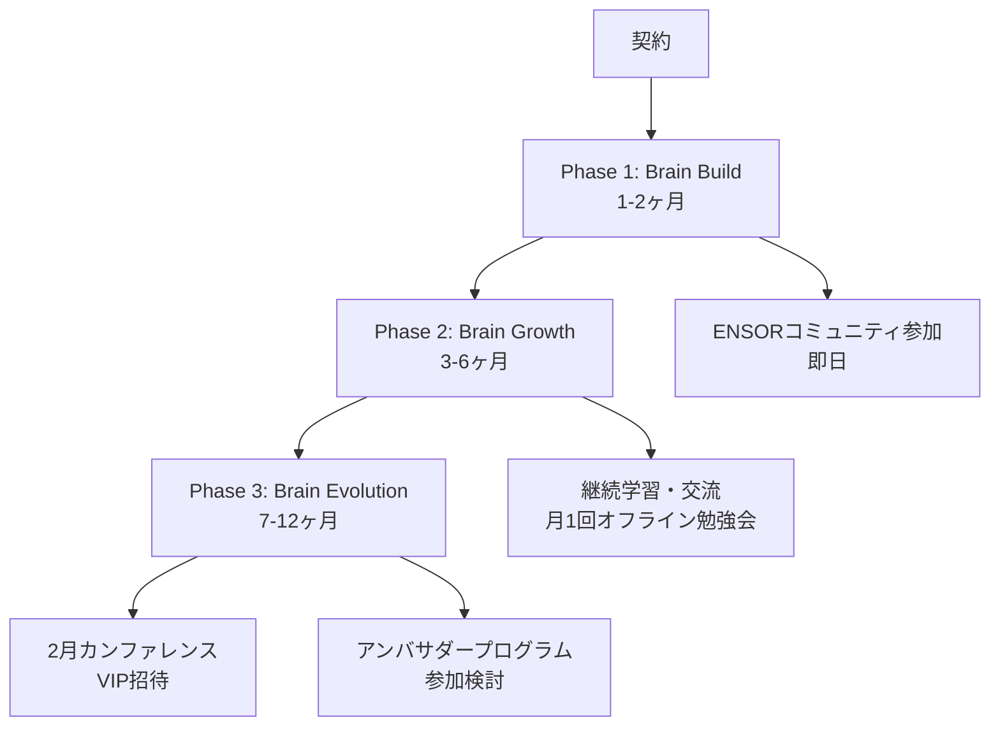

# ENSOR Growth Partner Program
## Marketing Brain育成プログラム

> **プログラムコンセプト**  
> あなたのMarketing Brainを育て、マーケティング全体を最適化する伴走支援

---

## 📋 プログラム全体像

---

## 🎯 プラン一覧

| プラン名 | 対象データ | 期間 | 主な特徴 |
|---------|-----------|------|---------|
| **Creative Brain Build** | クリエイティブデータ | 1-1.5ヶ月 | クリエイティブ生成特化 |
| **Marketing Brain Build** | クリエイティブ + GA + CRM/SFA | 2-3ヶ月 | 全マーケティング最適化 |
| **エンタープライズ** | 全データ + 複数ブランド | 2-3ヶ月 | 大企業向け統合ソリューション |

---

## 🎨 Creative Brain Build プラン

### 📊 対象データ
- **クリエイティブデータ**: 過去バナー、素材、ブランドガイドライン
- **ターゲットデータ**: ペルソナ、インサイト、訴求軸
- **パフォーマンスデータ**: 広告配信結果（有料オプション）
- **競合データ**: 競合クリエイティブ（有料オプション）

### 🚀 Phase 1: Creative Brain Build（1-1.5ヶ月）

#### ① ターゲット・インサイト整理
- [ ] プロジェクトゴール設定
- [ ] KPI定義
- [ ] ペルソナ深掘り
- [ ] カスタマージャーニーマップ作成
- [ ] 訴求ポイント整理

#### ② Creative Brain構築
**RAG構築**
- [ ] **クリエイティブRAG**: 過去バナー学習、素材データ蓄積
- [ ] **ブランドRAG**: カラー・フォント・ロゴ、トーン&マナー、NG表現
- [ ] **サービスRAG**: 強み・差別化・独自性
- [ ] **ターゲットRAG**: デモグラ、インサイト、キーワード、ペルソナ
- [ ] **パフォーマンスRAG**: 配信データ統合、勝ちパターン学習

**統合・検証**
- [ ] ENSORへのRAG統合
- [ ] 動作検証・品質確認
- [ ] テスト生成・ブラッシュアップ
- [ ] マーケチームトレーニング

### 📈 Phase 2: Creative Brain Growth（2-6ヶ月）

#### ① 機能利用
- [ ] クリエイティブ生成（月100本まで）
- [ ] クリエイティブ編集機能
- [ ] 共同コメント機能

#### ② 追加学習・ファインチューニング
- [ ] 過去バナー分析
- [ ] 成功・失敗パターン特定
- [ ] 6-12ヶ月配信結果分析
- [ ] 媒体×ターゲット×クリエイティブ相関分析

#### ③ 月次オンボーディング
**配信結果分析**
- [ ] ENSOR生成クリエイティブの配信状況確認
- [ ] パフォーマンス要因分析
- [ ] 次回クリエイティブへの反映

**総括レビュー**
- [ ] 第3者視点マーケティング診断
- [ ] 月間パフォーマンスサマリ
- [ ] クリエイティブタイプ別分析
- [ ] 媒体別最適化提案
- [ ] 競合・市場トレンド分析
- [ ] 次月配信戦略立案

### 🔄 Phase 3: Creative Brain Evolution（7-12ヶ月）

#### ① 機能利用
Phase 2と同様

#### ② 追加学習・ファインチューニング
**自動チューニング**
- [ ] 配信結果自動取り込み
- [ ] パフォーマンス指標自動学習
- [ ] クリエイティブデータベース拡充

**手動チューニング**
- [ ] 月次RAGチューニング
- [ ] ブランドガイドライン更新対応

#### ③ 月次オンボーディング
Phase 2と同様

---

## 🧠 Marketing Brain Build プラン

### 📊 対象データ
Creative Brain Buildプランの全データに加えて：
- **GAデータ**: Google Analytics上の全データ
- **CRM/SFA/売上データ**: 売上、LTV、リード、MQL/SQL、顧客デモグラ、経路情報

### 🚀 Phase 1: Marketing Brain Build（2-3ヶ月）

#### ① ターゲット・インサイト整理
Creative Brain Buildプランと同様

#### ② Marketing Brain構築
**RAG構築**
Creative Brain Buildプランの全RAGに加えて：
- [ ] **パフォーマンスRAG**: 広告・GA・CRM/SFAデータ統合

**統合・検証**
Creative Brain Buildプランの全機能に加えて：
- [ ] **ダッシュボード構築**: 全データ統合、データクレンジング
- [ ] **レポーティング・アラート**: 異常値検知、トレンド可視化、自動レポート
- [ ] **AIチャット機能**: 自然言語での質問回答

### 📈 Phase 2: Marketing Brain Growth（3-6ヶ月）

#### ① クリエイティブ生成機能
- [ ] クリエイティブ生成（月100本まで）
- [ ] AIが過去売上/成果につながるパターン分析して作成

#### ② ダッシュボード・AIチャット機能
- [ ] 媒体別〜広告別の数値可視化
- [ ] 主要KPI自動更新
- [ ] カスタムダッシュボード構築

**有料オプション**
- [ ] 予測モデル構築（月10万円）
- [ ] シミュレーション機能（月10万円）
- [ ] アトリビューション分析（月10万円）

#### ③ 追加学習・ファインチューニング
- [ ] CRM/SFAデータ自動学習
- [ ] 実売上パターン継続分析

#### ④ 月次オンボーディング
Creative Brain Buildプランに加えて：
- [ ] ダッシュボード精度確認
- [ ] AI分析売上貢献パターン確認

### 🔄 Phase 3: Marketing Brain Evolution（7-12ヶ月）

#### ① 機能利用
Phase 2と同様

#### ② ダッシュボード・AIチャット機能
Phase 2と同様、カスタマイズ対応

#### ③ 追加学習・ファインチューニング
- [ ] 業界特化型追加学習
- [ ] 季節性・イベント対応

#### ④ 月次オンボーディング
Creative Brain Buildプランに加えて：
- [ ] **他部門展開サポート**: セールス、広報、採用マーケ
- [ ] **ブランド横断活用**: 複数ブランド管理、知見共有
- [ ] **グローバル展開サポート**: 多言語対応、地域別最適化
- [ ] **自動化ワークフロー構築**: 生成→配信、分析→改善提案
- [ ] **セルフサービス化**: マニュアル整備、トレーナー育成
- [ ] **インハウス化移行サポート**: ナレッジ移管、運用体制確立

---

## 🏢 エンタープライズプラン

### 📊 対象データ
Marketing Brain Buildプランと同様

### 🚀 Phase 1: Marketing Brain Build（2-3ヶ月）

#### ① ターゲット・インサイト整理
Creative Brain Buildプランの内容を部門/ブランド別に実施

#### ② Marketing Brain構築（エンタープライズ拡張版）
Marketing Brain Buildプランの全機能に加えて：

**エンタープライズ拡張機能**
- [ ] **複数ブランド/事業部対応**: ブランド別Creative Brain、事業部別データ統合
- [ ] **無制限データソース連携**: 広告媒体、CRM/SFA、GA、その他マーケティングツール
- [ ] **カスタムAIモデル開発**: 業界特化型モデル、予測モデルカスタマイズ
- [ ] **セキュリティ対応**: オンプレミス展開、VPN接続、権限管理
- [ ] **エンタープライズダッシュボード**: 経営層向け、部門別、リアルタイム監視

### 📈 Phase 2: Marketing Brain Growth（3-6ヶ月）

#### ① クリエイティブ生成機能
- [ ] クリエイティブ生成（無制限）
- [ ] 全ブランド/事業部のクリエイティブ生成

#### ② ダッシュボード・AIチャット機能
- [ ] 全データソース統合ダッシュボード
- [ ] 経営層向けサマリダッシュボード
- [ ] 部門別ダッシュボード
- [ ] AIチャット高度データ探索
- [ ] カスタムレポート自動生成

#### ③ 追加学習・ファインチューニング
- [ ] ブランド横断インサイト学習
- [ ] 組織特有パターン学習
- [ ] グローバル展開対応

### 🔄 Phase 3: Marketing Brain Evolution（7-12ヶ月）

#### ① 機能利用
Phase 2と同様

#### ② ダッシュボード・AIチャット機能
Phase 2と同様、カスタマイズ対応

#### ③ 追加学習・ファインチューニング
**自動チューニング**
- [ ] Marketing Brain Buildプランの全自動チューニング
- [ ] ブランド間学習共有
- [ ] グローバルデータ統合学習
- [ ] エンタープライズ特有パターン自動抽出

**手動チューニング**
- [ ] Marketing Brain Buildプランの全手動チューニング
- [ ] 組織変更対応
- [ ] 新規事業・新ブランド対応

---

## 🌟 ENSORコミュニティ特典

### 📅 即日参加
- [ ] ENSOR活用方法・Tips日々共有
- [ ] AI×マーケティング最新トレンド通知
- [ ] 弊社独自調査資料アクセス

### 🎓 継続学習（Phase 2-3）
- [ ] 月1回限定オフライン勉強会参加
- [ ] AI×マーケティング活用術学習

### 🎪 特別イベント（Phase 3）
- [ ] 2月自社カンファレンスVIP席招待
- [ ] アンバサダープログラム参加検討

---

## 💡 チャーンレート抑制戦略

ENSORコミュニティ参加により：
- ✅ 継続的な価値提供
- ✅ 最新トレンド情報の提供
- ✅ 限定イベント参加権
- ✅ VIP特典による顧客満足度向上

---

*このプログラムにより、お客様のMarketing Brainを段階的に育成し、マーケティング全体の最適化を実現します。*
