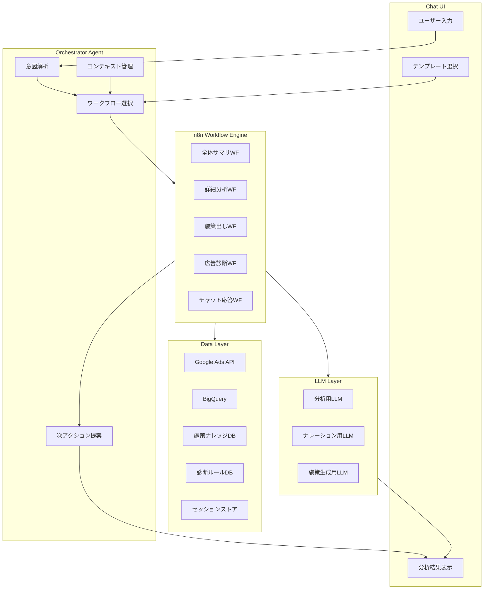
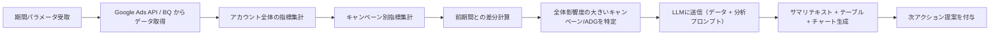
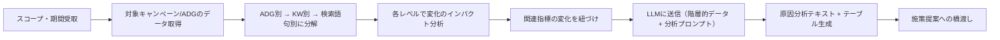
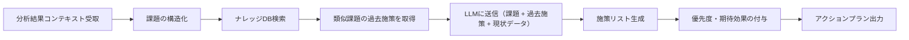
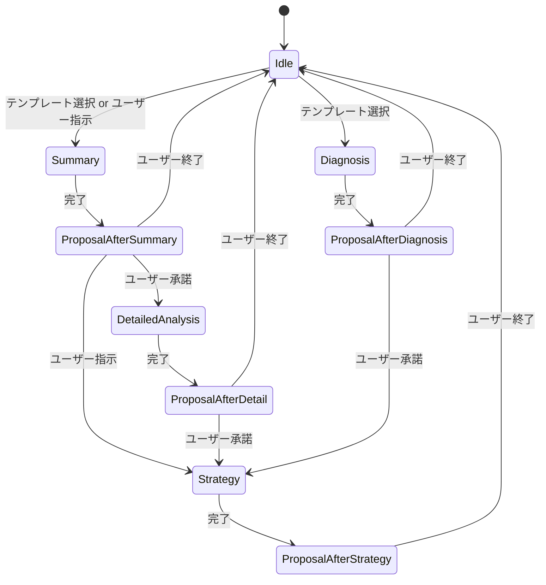

# Google Ads AI Agent - 裏側ロジック要件定義書

## 1. システム概要

Googleリスティング広告の分析・施策出しに特化したAIエージェント。チャットUI + テンプレート選択によりユーザーが操作し、裏側で複数のn8nワークフローが駆動して分析結果・施策を出力する。アンビエントエージェントとして、LLMがユーザーの文脈に応じて次のアクションを提案する。

- **利用者**: 自社の広告運用担当者（将来的にSaaS提供も視野）
- **対象広告**: Google Search Ads（リスティング広告）
- **アカウント管理**: 初期は単一アカウント対応。マルチテナント前提で設計

---

## 2. アーキテクチャ全体像




### レイヤー構成

- **Chat UI層**: GoMarble風のチャット + テンプレート選択画面。分析結果はMarkdown / テーブル / チャートで表示
- **Orchestrator Agent層**: LLMベースのオーケストレーター。ユーザー意図を解析し、適切なワークフローを選択・パラメータを設定。セッションコンテキストを保持し、次のアクションを提案
- **n8n Workflow Engine層**: 各分析パターンをn8nワークフローとして実装。データ取得 → データ整形 → LLM分析 → 出力整形のパイプライン
- **Data Layer**: Google Ads API / BQ / ナレッジDB / 診断ルールDB
- **LLM Layer**: 数値分析・解釈・ナレーション・施策生成を担当

---

## 3. データ層の設計

### 3.1 データソースと取得方法


| ソース            | 取得方法                 | 主な用途                 |
| -------------- | -------------------- | -------------------- |
| Google Ads API | REST API (OAuth 2.0) | リアルタイム指標取得、アカウント構造取得 |
| BigQuery       | Google Ads データエクスポート | 大量データの集計、過去データの分析    |


### 3.2 取得する指標群

**基本指標**: IMP, Click, Cost, CV, CPA, CTR, CVR

**品質指標**: 品質スコア（推定クリック率・広告の関連性・LPの利便性）

**オークション指標**: インプレッションシェア, ページ上部表示率, 最上部表示率

**検索語句**: 検索語句レポート（マッチタイプ含む）

**予算・配信**: 予算消化率, IS損失率（予算/ランク）, 入札戦略タイプ・目標値

**広告コピー**: 見出し・説明文別パフォーマンス

**LP関連**: LP別CVR

**セグメント**: デバイス別, 地域別, 時間帯別

**CV内訳**: CVアクション別の件数・値

### 3.3 分析粒度

アカウント → キャンペーン → 広告グループ → キーワード/広告 → 検索語句

各ワークフローが必要とする粒度レベルは異なる（後述）。

### 3.4 データキャッシュ戦略

- n8nワークフロー実行時にAPI/BQからデータを取得し、セッション内で再利用
- 頻繁に参照するデータ（アカウント構造、設定情報）はキャッシュ層を設ける
- マルチテナント対応時はアカウントIDでデータを分離

---

## 4. コアワークフロー設計

### 4.1 全体サマリ ワークフロー（優先度: 高）

**目的**: 指定期間のアカウント全体のパフォーマンスを俯瞰し、主要な変化を把握

**入力パラメータ**:

- 分析対象期間（例: 2025年1月）
- 比較対象期間（ユーザー選択。デフォルト: 前期間）

**処理フロー**:




**LLMへの入力データ**:

- アカウント全体の主要KPI（対象期間 vs 比較期間）
- キャンペーン別KPI一覧（変化率・影響度ランキング付き）
- 特に変化が大きいキャンペーン/ADGのハイライト

**LLMの役割**:

- 数値の変化を解釈し、重要な変化を特定
- 変化の原因仮説を推論（例:「キャンペーンAのCPA悪化はCVR低下が主因。IS損失率の増加も見られることから、競合の出稿強化の可能性」）
- 構造化されたサマリテキストを生成

**出力**:

- 全体KPIサマリ（テーブル + 前期比較）
- 主要変化のハイライト（テキスト）
- キャンペーン別パフォーマンスランキング（テーブル）
- トレンドチャート
- 次アクション提案（例:「詳細分析に進みますか？」）

---

### 4.2 詳細分析 ワークフロー（優先度: 高）

**目的**: 全体サマリで特定された変化の原因を、キーワード・広告・検索語句レベルまでドリルダウンして特定

**入力パラメータ**:

- 分析対象期間 / 比較対象期間
- 分析スコープ（特定キャンペーン/ADG、または全体サマリから自動引き継ぎ）
- 分析の焦点（改善要因 / 悪化要因 / 両方）

**処理フロー**:




**分析ロジック（LLMに渡す前の前処理）**:

- **インパクト分析**: 各キャンペーン/ADG/KWが全体変化に占める寄与度を計算
- **指標連鎖分析**: CPA変化 → CVR変化 or CPC変化 → CTR変化 or 入札変化、のように因果チェーンを構造化
- **異常検知**: 通常の変動幅を超える変化をフラグ

**LLMの役割**:

- 階層的データから変化の根本原因を推論
- 複数の要因が絡む場合の優先順位付け
- 運用者が理解しやすい説明文を生成

**出力**:

- 変化の原因ツリー（テキスト + 構造化表示）
- レベル別の変化テーブル（キャンペーン → ADG → KW）
- 原因仮説と確度の提示
- 施策出しへの提案（例:「この結果をもとに施策を検討しますか？」）

---

### 4.3 施策出し ワークフロー（優先度: 高）

**目的**: 分析結果とナレッジベースを参照し、具体的な改善施策を提案

**入力パラメータ**:

- 先行ワークフローの分析結果（全体サマリ・詳細分析のコンテキスト）
- ユーザーの追加コンテキスト（任意）

**処理フロー**:




**ナレッジベースの構造**:

- **施策テンプレート**: 課題パターン → 推奨施策のマッピング
- **過去事例**: 施策内容、実施前後の数値変化、成功/失敗フラグ
- **施策カテゴリ**: 入札調整 / KW追加・除外 / 広告文改善 / LP改善 / 構造変更 / ターゲティング変更

**LLMの役割**:

- 現状の課題とナレッジベースの過去事例をマッチング
- 課題の文脈に合わせた施策のカスタマイズ
- 期待効果の推論と優先度付け
- 施策の具体的なアクション手順の生成

**出力**:

- 施策リスト（優先度順）
- 各施策の詳細（根拠・期待効果・実施手順）
- 過去の類似事例の参照
- スプレッドシート/PDFエクスポート対応

---

### 4.4 広告診断 ワークフロー（優先度: 低 - Phase 2）

**目的**: 運用のベストプラクティスを基準に、現状のアカウント設定・構造の問題点を洗い出す

**診断ルール一覧**:

**アカウント構造チェック**:

- キャンペーン/ADGの粒度は適切か（テーマの混在がないか）
- ADGあたりのKW数は適正範囲か

**キーワードカバレッジ**:

- 除外KWの漏れ（検索語句レポートから不要語句を検出）
- マッチタイプの適切性
- 重複KWの検出

**入札戦略**:

- 自動入札の設定が目標値と整合しているか
- 学習期間中の過度な変更がないか

**広告品質**:

- 品質スコアが低いKWの検出
- 広告の有効性スコア
- レスポンシブ検索広告のアセット充足率

**予算効率**:

- IS損失率（予算）が高いキャンペーンの検出
- 予算制約による機会損失の推定

**CVトラッキング**:

- CVアクションの設定確認
- アトリビューションモデルの妥当性

**広告表示オプション**:

- サイトリンク・コールアウト等の設定有無
- 表示オプションのパフォーマンス

**処理フロー**: ルールベース判定 → 問題点リスト化 → LLMがナレーション + 優先度付け

---

## 5. オーケストレーション層（アンビエントエージェント）

### 5.1 設計思想

Orchestrator AgentはLLMベースのエージェントで、以下を担う:

1. **意図解析**: ユーザーのテキスト入力 or テンプレート選択から、実行すべきワークフローとパラメータを特定
2. **コンテキスト管理**: セッション内の分析結果・会話履歴を保持し、後続ワークフローに引き継ぐ
3. **次アクション提案**: ワークフロー完了後に、次に有用なアクションを提案（アンビエント動作）
4. **フリーテキスト応答**: ワークフロー外の質問にも、保持しているコンテキストをもとに回答

### 5.2 ワークフロー間の遷移ロジック




### 5.3 提案ロジックのルール

- **全体サマリ完了後**: 「変化が大きいキャンペーン/ADGの詳細分析に進みますか？」
- **詳細分析完了後**: 「この分析結果をもとに施策を検討しますか？」
- **施策出し完了後**: 「他のキャンペーンも分析しますか？」「診断を実行して設定上の改善点も確認しますか？」
- **広告診断完了後**: 「検出された問題点に対する施策を出しますか？」

### 5.4 コンテキスト引き継ぎ

セッションストアに以下を保持:

- 選択されたアカウント情報
- 分析対象期間 / 比較期間
- 各ワークフローの実行結果（数値データ + LLM分析結果）
- ユーザーの追加コンテキスト（自由記述内容）
- 会話履歴

→ 後続のワークフローはこのコンテキストを入力として受け取る

---

## 6. ナレッジベース設計

### 6.1 初期構築方法

手動登録。以下の構造でデータを蓄積:

```
施策レコード:
  - ID
  - 課題カテゴリ（CPA悪化, CVR低下, IS不足, ...）
  - 課題の詳細条件（例: "CVR低下 + 品質スコア低下"）
  - 施策内容（具体的なアクション）
  - 施策カテゴリ（入札調整 / KW / 広告文 / LP / 構造 / ターゲティング）
  - 実施前後の数値変化（任意）
  - 成功度（高/中/低）
  - 備考
```

### 6.2 検索ロジック

- 課題カテゴリ + 詳細条件でフィルタリング
- LLMがコンテキストを加味して最も関連性の高い施策を選択・カスタマイズ

---

## 7. LLM利用設計

### 7.1 LLMの5つの役割

1. **オーケストレーション**: ユーザー意図の解析、ワークフロー選択、次アクション提案
2. **数値分析**: データを受け取り、変化の特定・インパクト分析・異常検知を実行（Code Interpreter的）
3. **インタープリテーション**: 数値変化の「意味」や「原因仮説」を推論
4. **ナレーション**: 分析結果を自然言語でわかりやすく説明
5. **施策生成**: ナレッジベースを参照しつつ、文脈に合った施策文を生成

### 7.2 プロンプト設計のポイント

- 各ワークフローに専用のシステムプロンプトを用意
- 広告運用のドメイン知識を含むプロンプト（指標間の因果関係、業界用語、判断基準）
- 出力フォーマットを構造化（Markdown + JSON）してUI側でパース可能にする
- ハルシネーション対策: 数値データは必ず元データを参照させ、「推論」と「事実」を明確に区分

### 7.3 データをLLMに渡す際の設計

- 大量データはそのまま渡さず、前処理で集計・ランキング・フィルタリングを行う
- コンテキストウィンドウに収まるよう、階層的にサマリ → 詳細の段階的分析
- 数値テーブルはCSV or Markdown Table形式でLLMに渡す

---

## 8. 出力層の設計

### 8.1 出力フォーマット

- **チャットテキスト**: Markdown形式。見出し・箇条書き・太字で構造化
- **テーブル**: 指標比較テーブル、ランキングテーブル
- **チャート**: トレンド折れ線グラフ、構成比円グラフ、変化の棒グラフ
- **エクスポート**: スプレッドシート（CSV/Excel）、PDF

### 8.2 チャートライブラリ（UI側検討事項）

n8nワークフローからはチャートデータ（JSON）を出力し、UI側でレンダリング。

---

## 9. n8nワークフロー構成案

### 9.1 共通サブワークフロー

- **データ取得WF**: Google Ads API認証 → データ取得 → 整形
- **BQクエリWF**: BQへのクエリ実行 → 結果取得
- **LLM呼び出しWF**: プロンプト構築 → LLM API呼び出し → レスポンスパース
- **ナレッジ検索WF**: ナレッジDBへのクエリ → 関連施策取得

### 9.2 メインワークフロー

各コアワークフロー（全体サマリ/詳細分析/施策出し/広告診断）は、共通サブワークフローを組み合わせて構築。

### 9.3 Webhook/APIトリガー

n8nワークフローはWebhookトリガーで起動。Orchestrator AgentからHTTPリクエストで呼び出す。

```
Orchestrator → POST /webhook/summary { account_id, period, comparison_period }
n8n WF実行 → レスポンス返却
Orchestrator → ユーザーへ出力 + 次アクション提案
```

---

## 10. 開発フェーズ

### Phase 1（MVP）

- 全体サマリ ワークフロー
- 詳細分析 ワークフロー
- 施策出し ワークフロー（ナレッジDB手動登録）
- Orchestrator Agent（基本的なワークフロー選択 + 次アクション提案）
- 単一アカウント対応

### Phase 2

- 広告診断 ワークフロー
- チャート出力対応
- エクスポート機能
- フリーテキスト応答の強化

### Phase 3

- マルチアカウント対応
- ナレッジベース自動蓄積
- SaaS化に向けた認証・権限管理

