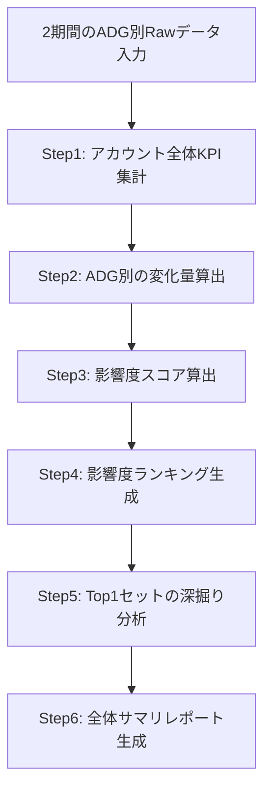

# 全体サマリ ワークフロー - 詳細要件定義

> 作成日: 2026-02-24
> 親ドキュメント: [Google_Ads_AIエージェント_要件定義.md](./Google_Ads_AIエージェント_要件定義.md) セクション4.1

---

## 1. 目的

指定した2期間のADG別実績Rawデータをもとに、アカウント全体のパフォーマンス変化を俯瞰し、**全体成果に最も影響を与えた「キャンペーン-広告グループ」のセットを1つ**特定する。

---

## 2. インプットデータ仕様

### 2.1 データ形式

- CSV形式（カンマ区切り or タブ区切り）
- 2期間分を別々のテーブルとして入力

### 2.2 カラム定義

| カラム名 | 型 | 説明 |
|---------|-----|------|
| campaign_name | string | キャンペーン名 |
| ad_group_name | string | 広告グループ名 |
| impressions | int | 表示回数 |
| clicks | int | クリック数 |
| cost | float | コスト（円） |
| conversions | int/float | コンバージョン数 |
| cpa | float | コスト / コンバージョン数（円） |
| ctr | float | クリック数 / 表示回数（%） |
| cvr | float | コンバージョン数 / クリック数（%） |

### 2.3 入力パラメータ

| パラメータ | 説明 | 例 |
|-----------|------|-----|
| 分析対象期間 | 分析したい期間 | 2026年1月 |
| 比較対象期間 | 比較する期間 | 2025年12月 |

---

## 3. 分析ロジック

### 3.1 処理フロー



### 3.2 Step1: アカウント全体KPI集計

各期間について、全ADGの数値を合算してアカウント全体のKPIを算出する。

```
全体IMP  = Σ impressions（全ADG）
全体Click = Σ clicks
全体Cost  = Σ cost
全体CV    = Σ conversions
全体CPA   = 全体Cost / 全体CV
全体CTR   = 全体Click / 全体IMP × 100
全体CVR   = 全体CV / 全体Click × 100
```

期間間の変化量・変化率を算出:
```
Δ指標 = 対象期間の値 - 比較期間の値
変化率 = Δ指標 / 比較期間の値 × 100
```

### 3.3 Step2: ADG別の変化量算出

各ADGについて、全指標の変化量・変化率を算出する。
新規ADG（比較期間に存在しない）や停止ADG（対象期間に存在しない）も検出する。

### 3.4 Step3: 影響度スコア算出（複合評価）

「全体成果への影響度」を以下の3軸で複合的に評価する:

#### 軸1: コスト変化寄与率
```
Cost寄与率_i = ΔCost_i / ΔCost_全体 × 100
```
そのADGのコスト変化が、全体のコスト変化のうち何%を占めるか。

#### 軸2: CV変化寄与率
```
CV寄与率_i = ΔCV_i / ΔCV_全体 × 100
```
そのADGのCV変化が、全体のCV変化のうち何%を占めるか。

#### 軸3: CPA変化インパクト（加重CPA寄与法）
```
CPA寄与_i（対象期間） = Cost_i_対象 / CV_全体_対象
CPA寄与_i（比較期間） = Cost_i_比較 / CV_全体_比較
ΔCPA寄与_i = CPA寄与_i（対象） - CPA寄与_i（比較）
```
各ADGのコストが全体CVに対してどれだけのCPA負担を生んでいるか。この変化量が大きいADGほど、全体CPAの変動に対するインパクトが大きい。

#### 複合影響度スコア
```
影響度スコア_i = |Cost寄与率_i| × 0.3 + |CV寄与率_i| × 0.3 + |ΔCPA寄与_i の偏差値| × 0.4
```

重みの根拠:
- CPA変化インパクトを最重視（0.4）: 広告運用の最終的な効率指標であるため
- Cost/CVの変化は同等（各0.3）: 規模変化の両面を均等に評価

> **注**: 上記の重みは初期値。テスト結果を見て調整する前提。

### 3.5 Step4: 影響度ランキング生成

影響度スコアの降順で全ADGをランキング化。
各ADGに対して以下を付与:
- 影響の方向性（ポジティブ / ネガティブ）
- 主要な変化要因（Cost増/減、CV増/減、CPA悪化/改善のどれが支配的か）

### 3.6 Step5: Top1セットの深掘り分析

ランキング1位の「キャンペーン-ADG」セットについて:
- なぜ影響度が最も大きいのかの説明
- 各指標の変化の連鎖分析（例: IMP減→Click減→CV減→全体CV減に寄与）
- 推定される原因仮説の提示

### 3.7 Step6: 全体サマリレポート生成

後述のアウトプット仕様に従い、構造化されたレポートを生成する。

---

## 4. アウトプット仕様

### 4.1 出力構成

レポートは以下の4セクションで構成:

#### セクションA: 全体KPIサマリ

| 指標 | 比較期間 | 対象期間 | 変化量 | 変化率 |
|------|---------|---------|-------|-------|
| IMP | xxx | xxx | +xxx | +x.x% |
| Click | ... | ... | ... | ... |
| Cost | ... | ... | ... | ... |
| CV | ... | ... | ... | ... |
| CPA | ... | ... | ... | ... |
| CTR | ... | ... | ... | ... |
| CVR | ... | ... | ... | ... |

全体の変化を1-2文で要約。

#### セクションB: ADG別影響度ランキング

| 順位 | キャンペーン | 広告グループ | 影響方向 | Cost変化 | CV変化 | CPA変化 | 主要変化要因 |
|------|-----------|------------|---------|---------|--------|---------|------------|
| 1 | xxx | xxx | ネガティブ | +30% | -10% | +44% | Cost増+CV減 |
| 2 | ... | ... | ... | ... | ... | ... | ... |
| ... | ... | ... | ... | ... | ... | ... | ... |

#### セクションC: 最も影響の大きいキャンペーン-ADGセット（Top1）

- **対象**: {キャンペーン名} - {ADG名}
- **影響の方向性**: ポジティブ or ネガティブ
- **変化の概要**: 各KPIの変化を簡潔に記載
- **指標連鎖分析**: IMP→Click→CV→CPA の変化の因果チェーン
- **全体への影響度**: 「全体CPA悪化の約XX%はこのADGに起因」のような定量的説明
- **推定原因仮説**: データから推論される変化の原因

#### セクションD: 総合所見

- 全体的なアカウントの状態評価（改善基調 / 悪化基調 / 横ばい）
- 注視すべきポイント
- 次のアクション提案（「詳細分析に進みますか？」等）

### 4.2 出力品質基準

- 数値は必ず元データから算出し、ハルシネーションを排除
- 「事実」（数値の変化）と「推論」（原因仮説）を明確に区分
- 変化率は小数点1桁まで表示
- コスト・CPAは通貨単位（円）を付与
- 定量的な表現を優先（「大幅に増加」ではなく「+32.5%増加」）

---

## 5. エッジケース対応

| ケース | 対応方針 |
|--------|---------|
| 新規ADG（比較期間にデータなし） | 対象期間の数値をそのまま変化量とし、変化率は「新規」と表示 |
| 停止ADG（対象期間にデータなし） | 比較期間の数値のマイナスを変化量とし、変化率は「停止」と表示 |
| CV=0のADG | CPA/CVRは「-」と表示。Cost変化寄与のみで評価 |
| 全体ΔCost=0（コスト変化なし） | Cost寄与率は算出不可。CV寄与率とCPA寄与に重み再配分（0:0.5:0.5） |
| 全体ΔCV=0（CV変化なし） | CV寄与率は算出不可。Cost寄与率とCPA寄与に重み再配分（0.5:0:0.5） |
| ADG数が非常に多い場合 | ランキングテーブルは上位10件 + 下位3件を表示。残りは省略 |

---

## 6. テスト計画

### 6.1 テスト方法

Geminiに直接CSVデータとプロンプトを入力し、出力品質を検証する。

### 6.2 検証ポイント

- [ ] アカウント全体KPIの集計が正しいか
- [ ] 影響度スコアの算出ロジックが正しく適用されているか
- [ ] Top1セットの選定が妥当か（手動計算と一致するか）
- [ ] 指標連鎖分析が論理的に正しいか
- [ ] 原因仮説が飛躍していないか
- [ ] 出力フォーマットが仕様通りか
- [ ] エッジケース（CV=0、新規ADG等）が正しく処理されるか

### 6.3 テスト用ダミーデータ

テスト用プロンプトファイルにダミーデータを同梱（別ファイル参照）。
